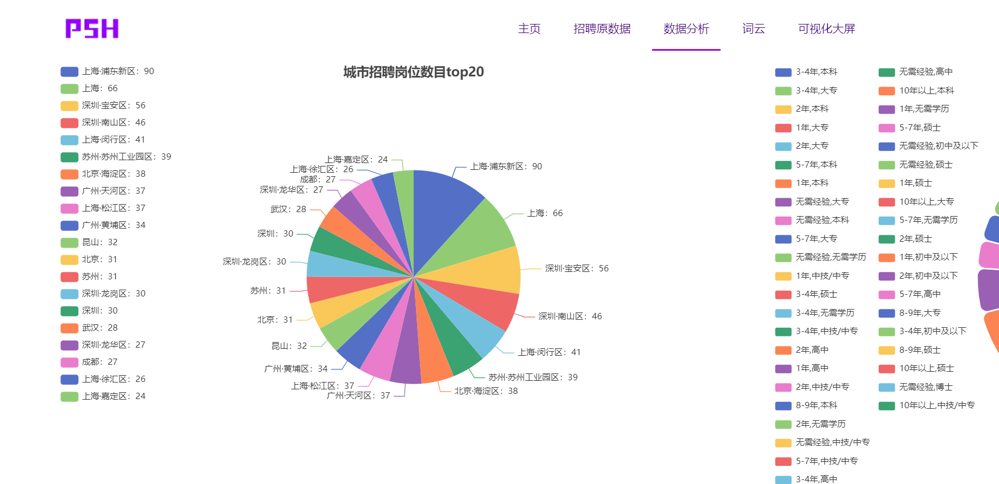
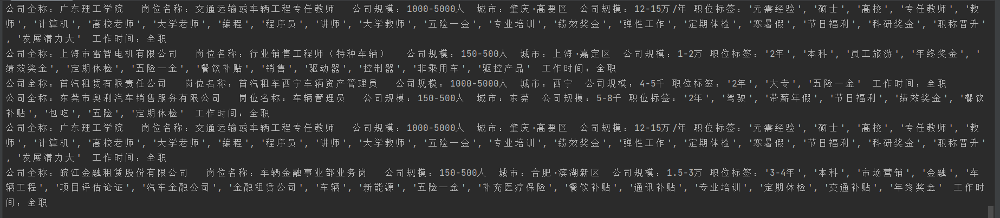
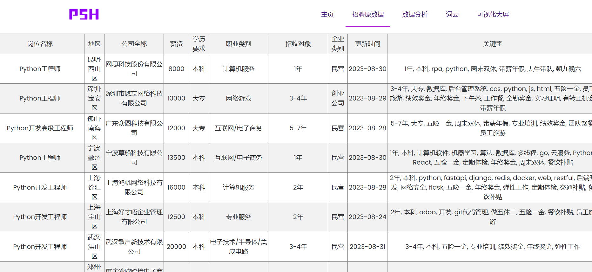

<h1 align="center">
  <p>
    51job招聘网站爬取及可视化
  <p>
</h1>
<div>
<h4 align="center">
    <p>
        <b>中文</b> |
        <a href="/README_EN.md">English</a>
    <p>
</h4>
</div>

# 效果展示⌛

----

1. web展示




2. 数据爬取




# 简介📝

------
- 🌐自定义爬取职业关键词与数量
- 📈大屏数据实时显示招聘情况
- 🎨echart生成数据分析图像 
- 🐳采用mysql存储，实现前端数据交互

# 启动爬虫服务⚡

------
1. 首先先下载依赖包（我没有筛选直接生成的包，所以可能有点杂🚨）
```
pip install -r requirements.txt
```
2. 修改配置文件`config.ini` 添加mysql、账户信息等

3. 运行爬虫
```
python crawler.py
```

# web可视化✨

项目文件夹下终端运行命令

------

```
python app.py
```
or
```
flask run
```
