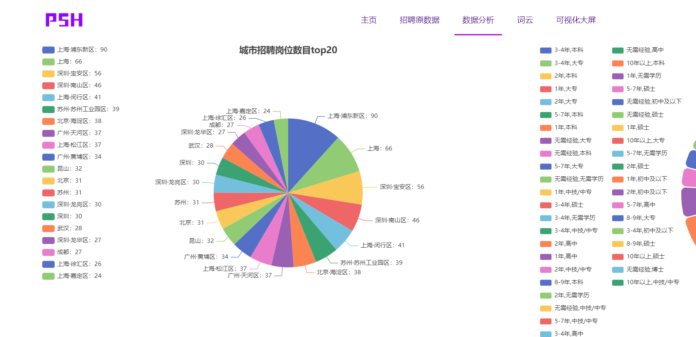
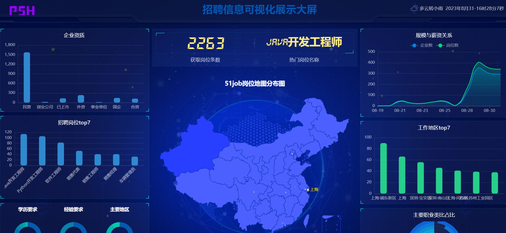
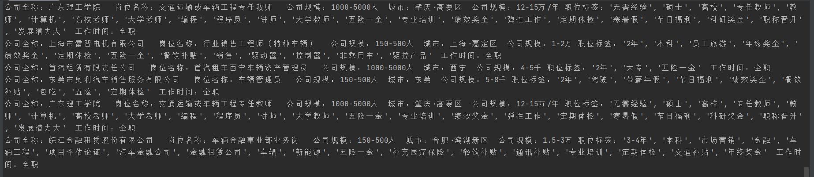
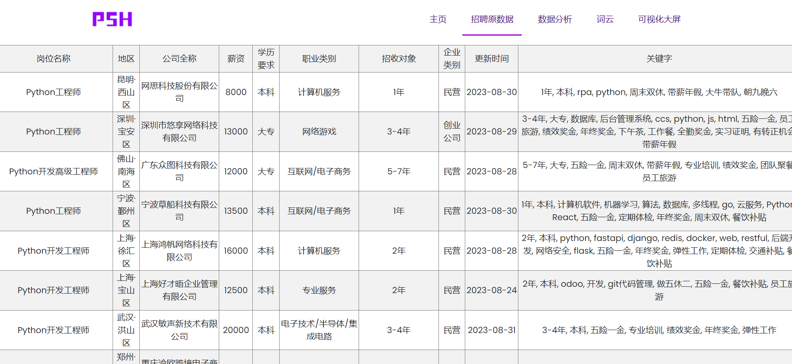

<h1 align="center">
  <p>
    51job Recruitment Website Scraping and Visualization
  <p>
</h1>
<div>
<h4 align="center">
    <p>
        <a href="/README_EN.md">English</a>|
        <b>中文</b> 
    <p>
</h4>
</div>

# Demonstration⌛

----

1. Web Display





2. Data Crawling




# Introduction📝

------
- 🌐 Customizable scraping of job keywords and quantities
- 📈 Real-time display of recruitment situation on a large screen
- 🎨 Generating data analysis graphics using ECharts
- 🐳 Using MySQL for storage to achieve frontend data interaction

# Start the Scraping Service⚡

------
1. First, download the required packages (I didn't filter the generated packages directly, so there might be some clutter🚨)
```
pip install -r requirements.txt
```

2. Modify the configuration file `config.ini` and add MySQL, account information, etc.

3. Run the crawler

```
python crawler.py
```

# Web Visualization✨

Run the command in the terminal under the project folder

------

```
python app.py
```

or

```
flask run
```
